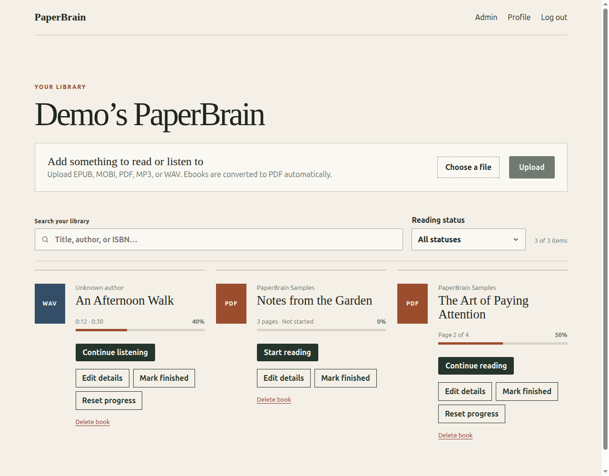
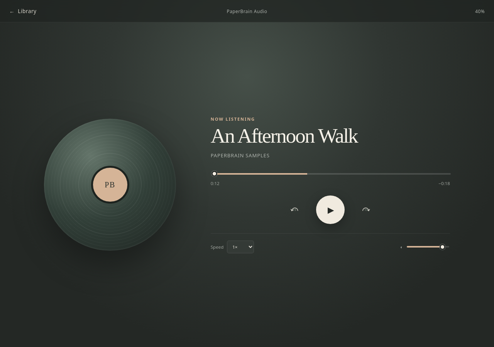
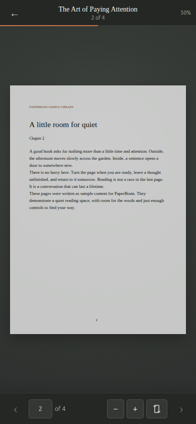

# PaperBrain

Licensed under GPL-3.0-only; see [LICENSE](LICENSE).
See [RELEASE.md](RELEASE.md) for verification commands and conversion limitations.

A self-hosted reading and listening library for EPUB, MOBI, PDF, MP3, and WAV files. EPUB and MOBI books are converted to PDF; PaperBrain remembers page or playback progress.

Install with [Docker](#quick-start-with-docker) or [bare metal, without Docker](docs/BARE_METAL.md).
See [CHANGELOG.md](CHANGELOG.md) for the initial 0.1.0 release.

**Conversion limits:** EPUB/MOBI conversion is text-first. Images, tables, complex
layout, and some non-Latin text may be lost. DRM-protected MOBI and KF8-only books
are unsupported. Original PDFs retain their layout; scanned PDFs have no OCR.

## Screenshots

Demo content generated for these screenshots; no private books or accounts are shown.







## Quick start with Docker

Requirements: Docker Engine with Docker Compose.

```bash
git clone https://github.com/1338/PaperBrain.git
cd PaperBrain
cp .env.example .env
```

Before starting, edit `.env`:

- replace `SESSION_SECRET` with the output of `openssl rand -hex 32`;
- replace `POSTGRES_PASSWORD` with a strong URL-safe password;
- optionally change `APP_PORT` from `3000`.

Start the complete application:

```bash
docker compose up -d --build
```

Open `http://localhost:3000` (or your `APP_PORT`). The application waits for PostgreSQL, applies database migrations automatically, and then starts the web server. Create your own administrator account before exposing the service publicly.

Check status and logs with:

```bash
docker compose ps
docker compose logs -f app
```

## Persistent data

Compose creates two named volumes:

- `paperbrain_database_data` contains accounts, library metadata, sessions, and reading progress;
- `paperbrain_book_storage` contains uploaded ebooks/PDFs/audio and generated PDFs.

The `paperbrain_` prefix assumes the default project directory name. If you use a
different directory or `docker compose -p NAME`, the volumes use that project
prefix; substitute the actual volume name in backup/restore commands.

Normal container recreation and `docker compose down` preserve both volumes. Do not run `docker compose down --volumes` unless you intend to permanently delete all PaperBrain data.

### Backup

Stop the app to keep the database and files consistent during backup (the
database service stays running), then create both backups:

```bash
mkdir -p backups
chmod 700 backups
docker compose stop app
docker compose exec -T database pg_dump -U app app > backups/paperbrain.sql
docker run --rm -v paperbrain_book_storage:/data -v "$PWD/backups:/backup" alpine tar czf /backup/paperbrain-books.tgz -C /data .
docker compose start app
```

If you changed `POSTGRES_USER` or `POSTGRES_DB`, use those values in the `pg_dump` command. Test restoring backups before relying on them.
Securely back up `.env` separately; the original `SESSION_SECRET` is needed to
decrypt saved credentials. S3 objects require their own backup.

## Restore to a fresh installation

Restore into empty volumes on a separate host/project first. These commands
assume the default database name/user (app), the Compose project name
paperbrain, and the backup filenames above. Keep the application stopped
until both backups are restored:

```bash
docker compose -p paperbrain up -d database
docker compose -p paperbrain exec -T database psql -v ON_ERROR_STOP=1 -U app -d app < backups/paperbrain.sql
docker volume create paperbrain_book_storage
docker run --rm -v paperbrain_book_storage:/data -v "$PWD/backups:/backup:ro" alpine tar xzf /backup/paperbrain-books.tgz -C /data
docker compose -p paperbrain up -d --build app
```

Restore the original SESSION_SECRET in your private .env before starting.
For S3 libraries, retain/restore the bucket objects as well as the database.
The filesystem archive does not contain S3 objects. Check a PDF, an audio
item, and saved progress after restoring. Do not import a dump over an
existing database; use a fresh restore target.

## Administrator-assisted password recovery

An administrator with shell access can reset an existing account's password.
The command does not send email, create accounts, change roles, activate disabled
accounts, or bypass email verification. It revokes existing login sessions.
Use a new password of at least 12 characters; communicate it privately and have
the user change it in Profile after logging in.

Run these commands in Bash (the password is hidden and is not a command argument):

```bash
read -r -s -p 'New password: ' recovery_password
printf '\n'
printf '%s' "$recovery_password" | docker compose exec -T app npm run account:recover -- user@example.com
unset recovery_password
```

For a non-Docker installation, pipe the password into `npm run account:recover --
user@example.com` from the project directory with the correct private `.env`.
Use the admin panel to resolve disabled/unverified accounts separately.

## Background ebook conversion

EPUB/MOBI uploads enter a persistent database queue. The library refreshes their
status automatically; leaving the page does not cancel a job. One conversion
runs per database at a time in an isolated Node process (512 MiB JavaScript heap
limit). `CONVERSION_TIMEOUT_SECONDS` defaults to 300; timed-out jobs show an error
and can be retried. PDF/audio metadata processing remains synchronous.

Start with `npm start`, `npm run dev`, or Docker so the queue runner is active.
Interrupted ebook jobs are picked up again after restart. Instances sharing a
database must also share the local storage directory: queued sources are local
until conversion and any S3 transfer finish. S3 configuration at processing time
determines the destination. Do not change storage configuration with jobs pending.
The heap limit is not a total process-memory cap; use container memory limits for
untrusted uploads. An active conversion must finish or time out before deletion.

## Updating the application

```bash
git pull
docker compose up -d --build
```

The application image runs the idempotent schema migration before each startup. Back up both volumes before significant upgrades.

## HTTPS and reverse proxies

For use outside a trusted local network, place PaperBrain behind an HTTPS reverse proxy such as Caddy, Traefik, or nginx. Set this in `.env` once requests use HTTPS:

```dotenv
COOKIE_SECURE=true
```

Leave it `false` only for direct HTTP access. PaperBrain trusts one reverse-proxy hop and binds the published application port configured by `APP_PORT`.

The PostgreSQL port is bound only to `127.0.0.1` for local maintenance. It is not exposed on the host network externally.

## Configuration

| Variable | Default | Purpose |
|---|---|---|
| `APP_PORT` | `3000` | Host port for PaperBrain |
| `PORT` | `3000` | Bare-metal HTTP port; Compose sets the internal port automatically |
| `DATABASE_URL` | Local development URL | Bare-metal PostgreSQL connection string |
| `STORAGE_PATH` | `./storage` | Bare-metal storage path; Compose uses `/data` |
| `CONVERSION_TIMEOUT_SECONDS` | `300` | Maximum background conversion job duration |
| `SESSION_SECRET` | Required | Random session-signing secret of at least 32 characters |
| `COOKIE_SECURE` | `false` | Send the session cookie only over HTTPS |
| `ADMIN_EMAIL` | Empty | Optionally grant admin to a matching registering account |
| `MAX_UPLOAD_SIZE_MB` | `100` | Maximum EPUB, MOBI, PDF, MP3, or WAV upload size |
| `POSTGRES_DB` | `app` | PostgreSQL database name |
| `POSTGRES_USER` | `app` | PostgreSQL user |
| `POSTGRES_PASSWORD` | `ChangeMe` | PostgreSQL password; change before deployment |
| `POSTGRES_PORT` | `5432` | Optional localhost-only database port |

Inside the container, `DATABASE_URL`, `NODE_ENV`, `PORT`, and `STORAGE_PATH` are configured automatically by Compose.

The bundled PostgreSQL service uses `DATABASE_SSL=false`. Manual deployments using a managed PostgreSQL provider can set `DATABASE_SSL=true` when that provider requires TLS.

## Local development

Requirements: Node.js 22.13+, npm, and PostgreSQL (Docker is optional).
Configure `.env` as described in the Docker or bare-metal guide before continuing.

```bash
docker compose up -d database # Skip if using an existing PostgreSQL server
npm ci
npm run db:migrate
npm run dev
```

Open `http://localhost:5173`. Vite proxies API requests to the Node server on port `3000`. If the production app container is already running, stop it first with `docker compose stop app` to free that port.
For development, keep `PORT=3000` or update the API proxy target in `vite.config.js`.
If Docker database credentials/ports differ from defaults, also update the
host-side `DATABASE_URL` in `.env`; Compose does not generate that value for npm.

## Commands

```bash
npm run dev         # Run frontend and API in watch mode
npm run build       # Build the Vue application
npm start           # Serve the production API and built frontend
npm run db:migrate  # Create/update the PostgreSQL schema
npm test            # Run tests
```

## Reader controls

- Use Previous/Next or the left/right arrow keys to change pages.
- Page Up/Down and Space also navigate; Home/End jump to the first/last page.
- Zoom controls and Fit width are available in the reader toolbar.
- Reading progress is saved automatically.
- Standalone PDFs open directly without conversion.
- MP3 and WAV playback position is restored automatically.
- Failed conversions can be retried from the library.
- Deleting an item permanently removes its database record and all stored source/derived files.

## Health checks

- `GET /api/health/live` checks the application process.
- `GET /api/health/ready` checks database availability.

Docker uses the readiness check to report container health.

See [FUNCTIONALITY.md](FUNCTIONALITY.md) for the complete feature index and current conversion limitations.

## Administration

The first account on an instance is automatically an administrator. Existing installations promote the oldest account during migration if no administrator exists. `ADMIN_EMAIL` can also identify an account that should receive the administrator role when it registers.

Administrators can open `/admin` to:

- enable or disable public registration;
- require email verification;
- configure SMTP and send a test email;
- choose local file storage or configure and test an S3-compatible bucket;
- activate, disable, verify, promote, demote, or delete users.

SMTP passwords and S3 secret keys are encrypted in PostgreSQL using a key derived from `SESSION_SECRET`. Keep that secret stable across upgrades; changing it prevents PaperBrain from decrypting saved credentials.

Local filesystem storage is the default and uses the persistent Docker data volume described above. S3 mode supports AWS S3 and compatible services such as MinIO: provide a region and bucket, optionally a custom endpoint, and enable path-style URLs when the provider requires them. Files are served through PaperBrain, so the bucket does not need public access or browser CORS rules.

The selected backend applies to new uploads. Existing local files remain local and existing S3 files remain in their bucket. Test S3 settings before saving them, and do not change or remove a bucket or credentials while it still contains library files.

## User profiles

Authenticated users can open `/profile` to change their display name, email address, or password. Email and password changes require the current password. When instance email verification is enabled, an email change sends a fresh verification link and signs the user out until the new address is verified.
